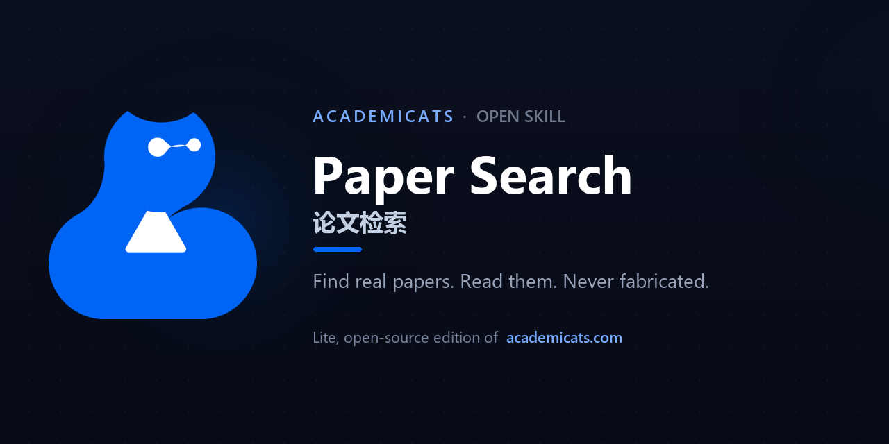

<div align="center">

**English** · [中文](README.zh-CN.md)



<br>

# 🐱 Paper Search

**Find real academic papers across the world's scholarly databases — then read any open-access one in depth. Grounded in real data, never fabricated.**

<br>

[](LICENSE)
&nbsp;[](https://claude.com/claude-code)
&nbsp;[](https://academicats.com)

</div>

---

> ### 🪶 This is the **lite, open-source edition** of [**AcademiCats**](https://academicats.com)
> The full product at **[academicats.com](https://academicats.com)** is an AI research workbench that takes you from *finding* papers all the way through *reading, writing, and self-review* — with Google Scholar breadth, Chinese-language sources, saved libraries, a polished UI, and a multi-agent reviewer. This skill is a free, self-contained slice of that workflow you can run on your own Claude.

---

## ✨ What it does

🔍 **Search that means it** — one question fans out across five scholarly databases (OpenAlex, Crossref, arXiv, Semantic Scholar, Europe PMC), de-duplicates, and ranks by genuine research fit — not just keyword overlap.

📄 **Read, not skim** — pick any open-access paper and it resolves the PDF, extracts the text, and gives you a structured, page-anchored reading: the research question, method, key findings, and limitations.

🛡️ **No made-up papers, no made-up findings** — every result is a real record from a public API, and every reading is built only from the actual extracted text. When a paper is paywalled, it says so — it never invents the contents.

<br>

## 🎬 Demo

Just ask Claude, in plain language:

> *"Find me papers since 2020 on CRISPR off-target effects, then deep-read the most relevant open-access one."*

Behind the scenes it runs a real search and hands back a ranked shortlist:

```
# 6 papers for: CRISPR off-target effects
 #  year  cites  OA  score   title
 1  2023    537  Y   56.4  Off-target effects in CRISPR/Cas9 gene editing
 2  2020    451  Y   54.7  Latest Developed Strategies to Minimize the Off-Target Effects…
 3  2026      0  -   46.0  Decoding the role of chromatin context in off-target effects…
 4  2023      7  Y   45.5  Systematic identification of CRISPR off-target effects by CROss-seq
 …
```

…then opens the open-access PDF and reads it back to you with findings tied to page numbers — grounded entirely in the paper's own text.

<br>

## 🚀 Get started in 60 seconds

```bash
# 1. install into Claude Code's skills folder
mkdir -p ~/.claude/skills
git clone https://github.com/jy1529098645-gif/Cat_paper_search.git ~/.claude/skills/paper-search

# 2. install the one dependency (Python 3.8+, for reading PDFs)
cd ~/.claude/skills/paper-search && python -m pip install -r scripts/requirements.txt
```

Restart Claude Code so it loads the skill. From then on, just talk to Claude — *"find recent papers on …"*, *"summarise this arXiv paper …"* — and it triggers itself. Everything runs on your own Claude; all data sources are free and need no API keys.

<br>

## 💙 Why people like it

|  | Paper Search (this skill) | [AcademiCats full product →](https://academicats.com) |
|---|:---:|:---:|
| Real papers, honest reading | ✅ | ✅ |
| Scholarly databases | 5 (key-free) | 14+ incl. Google Scholar & Chinese sources |
| Saved libraries & history | — | ✅ |
| Write & self-review from your sources | — | ✅ Synthesis Lab + Paper Review |
| Polished web & mobile app | — | ✅ |

<div align="center">
<br>

### Want the whole research workflow?
**→ [academicats.com](https://academicats.com) ←**

<br>

Made with 💙 by the [AcademiCats](https://academicats.com) team · [MIT License](LICENSE)

</div>
