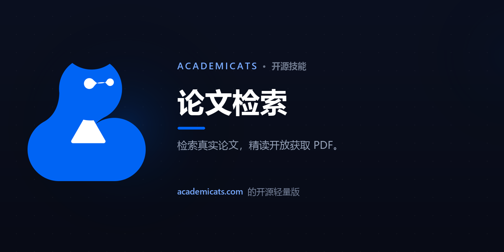

<div align="center">

[English](README.md) · **中文**



<br>

# 🐱 论文检索

**跨全球学术库检索真实论文，并深度精读任意开放获取 PDF。基于真实数据，绝不编造。**

<br>

[](LICENSE)
&nbsp;[](https://claude.com/claude-code)
&nbsp;[](https://academicats.com)

</div>

---

> ### 🪶 这是 [**AcademiCats**](https://academicats.com) 的**开源轻量版**
> 完整产品在 **[academicats.com](https://academicats.com)** —— 一个 AI 研究工作台，带你从*找文献*一路走到*读、写、自审*：拥有 Google Scholar 级广度、中文文献源、文献库保存、精致界面和多智能体审稿。本 skill 是这套工作流中一块免费、自包含、可在你自己的 Claude 上运行的切片。

---

## ✨ 它能做什么

🔍 **真正管用的检索** —— 一个问题同时扇出到五大学术库（OpenAlex、Crossref、arXiv、Semantic Scholar、Europe PMC），去重，并按**真实研究契合度**排序，而不只是关键词重叠。

📄 **精读，而非略读** —— 任选一篇开放获取论文，它会解析 PDF、抽取正文，给你一份结构化、**逐条标注页码**的精读：研究问题、方法、核心发现、局限。

🛡️ **不编论文，不编结论** —— 每条结果都是公共 API 的真实记录，每份精读只基于真正抽取到的正文。论文被付费墙挡住时，它会**直说**，绝不杜撰内容。

<br>

## 🎬 演示

直接用大白话问：

> *"帮我找关于 CRISPR 脱靶效应的论文。"*

它会先弹一个**搜索设置**让你选——主动权在你手上，换任何大模型都一样：

> 🔍 **搜索设置** —— 确认或修改，然后我就去搜：
> 1. **主题** —— CRISPR 脱靶效应
> 2. **要几篇** —— 20  *(10 / 20 / 40)*
> 3. **年份** —— 不限  *(如 2020–2026)*
> 4. **仅开放获取**（只要你能读到全文的）—— 否  *(是 / 否)*
> 5. **排序** —— 最佳匹配  *(最佳匹配 / 最新 / 被引最多 / 开放获取优先)*
>
> 回复任何修改，或直接说 **go**。

确认后它真实地跑一次检索，返回一份**带编号的结果列表**——每篇一行、可扫描，你能直接按序号操作。格式由工具固定生成，**换任何大模型跑都长一个样**：

> ## 🔎 共 5 条结果：CRISPR off-target effects
> 1. **[Off-target effects in CRISPR/Cas9 gene editing](https://doi.org/10.3389/fbioe.2023.1143157)** — Congting Guo et al. · 2023 · 被引 537 · 🟢 · [PDF](https://www.frontiersin.org/articles/10.3389/fbioe.2023.1143157/pdf)
> 2. **[Latest Developed Strategies to Minimize Off-Target Effects in CRISPR-Cas Genome Editing](https://doi.org/10.3390/cells9071608)** — Naeem et al. · 2020 · 被引 451 · 🟢 · [PDF](https://www.mdpi.com/2073-4409/9/7/1608/pdf)
> 3. **[CRISPR/Cas Systems in Genome Editing: sgRNA Design & Off‑Target Evaluation](https://doi.org/10.1002/advs.201902312)** — Manghwar et al. · 2020 · 被引 357 · 🟢 · [PDF](https://onlinelibrary.wiley.com/doi/pdfdirect/10.1002/advs.201902312)
> 4. **[CRISPR/Cas13 effectors have differing off-target effects in eukaryotic cells](https://doi.org/10.1093/nar/gkac159)** — Ai et al. · 2022 · 被引 151 · 🔒
> 5. **[Beyond the promise: evaluating & mitigating off-target effects for safer therapeutics](https://doi.org/10.3389/fbioe.2023.1339189)** — Lopes et al. · 2024 · 被引 62 · 🟢

标题直接链接原文；🟢 表示有可读全文的免费 PDF。然后你只要说 **"深读 #1"**——它就打开那篇的 PDF，把发现逐条标注页码读给你听，完全基于论文自身的正文。

<br>

## 🚀 60 秒上手

```bash
# 1. 安装到 Claude Code 的 skills 目录
mkdir -p ~/.claude/skills
git clone https://github.com/jy1529098645-gif/Cat_paper_search.git ~/.claude/skills/paper-search

# 2. 装唯一的依赖（Python 3.8+，用于读 PDF）
cd ~/.claude/skills/paper-search && python -m pip install -r scripts/requirements.txt
```

重启 Claude Code 让它加载 skill。之后直接跟它说 —— *"找几篇关于…的最新论文"*、*"总结这篇 arXiv 论文…"* —— 它会**自动触发**，无需记任何命令。全程跑在你自己的 Claude 上，所有数据源免费、无需 API key。

**用网页版 / 桌面版 Claude？** 下载 **[`paper-search.skill`](paper-search.skill)**，在 **Settings → Capabilities → Skills** 里上传，然后在任意对话里直接问即可。（检索与读 PDF 的脚本会在 Claude 自带的代码沙箱里运行。）

<br>

## 💙 大家为什么喜欢它

|  | 论文检索（本 skill） | [AcademiCats 完整产品 →](https://academicats.com) |
|---|:---:|:---:|
| ⚡ **速度** | 几分钟（在你的 Claude 上实时跑） | **数秒** —— 优化管线 + 缓存 |
| 真实论文、诚实精读 | ✅ | ✅ |
| 学术数据库 | 5 个（免 key） | 14+，含 Google Scholar 与中文源 |
| 文献库保存与历史 | — | ✅ |
| 据文献写作与自审 | — | ✅ Synthesis Lab + Paper Review |
| 精致的网页与移动端 | — | ✅ |

## 🐱 AcademiCats 技能家族

三个开源 skill，串起一条完整的研究工作流——按需安装其一或全部：

- 🔍 **论文检索** *（你在这里）* —— 找文献、读文献
- ✍️ [文献写作台](https://github.com/jy1529098645-gif/Cat_synthesis_lab) —— 据你的文献写出有据成稿
- 🧪 [模拟同行评审](https://github.com/jy1529098645-gif/Cat_paper_review) —— 对你自己的草稿做同行评审

**一次装齐三个** —— clone 任意一个仓库后运行 `bash install.sh`。

## 🙋 常见问题

- **没触发？** 安装后重启 Claude Code，并把话说成一个任务 —— *"找几篇关于…的最新论文"*。
- **某篇打不开？** 那是付费墙、没有免费副本——skill 会直说，而不是瞎编。换一篇，或直接粘 DOI / PDF 链接。
- **有时为什么不到 5 个库？** Semantic Scholar 对无 key 流量限流。脚本会自动重试，其余 4 个库照样兜底——或申请一个免费 [S2 API key](https://www.semanticscholar.org/product/api)，`export S2_API_KEY=...` 后就能稳定带上它。
- **用哪个模型？** 任何模型都能跑；用 Claude Sonnet 及以上效果最好。
- **隐私 & 免费？** 全程跑在你自己的 Claude 上——无需账号、不向我们回传任何东西，检索只访问公开学术 API。

<div align="center">
<br>

### 想要完整的研究工作流？
**→ [academicats.com](https://academicats.com) ←**

<br>

由 [AcademiCats](https://academicats.com) 团队用 💙 打造 · [MIT 许可证](LICENSE)

</div>
